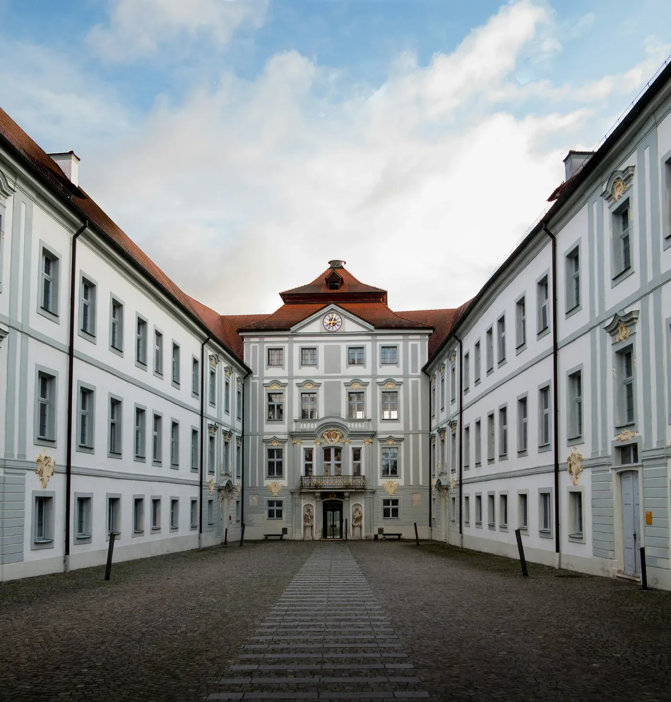
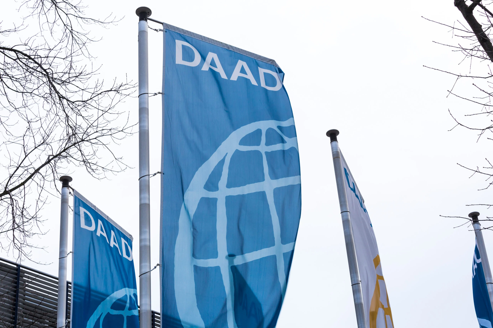
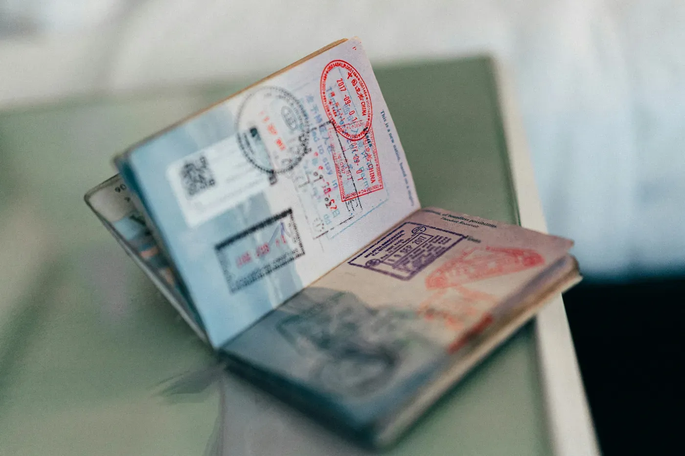
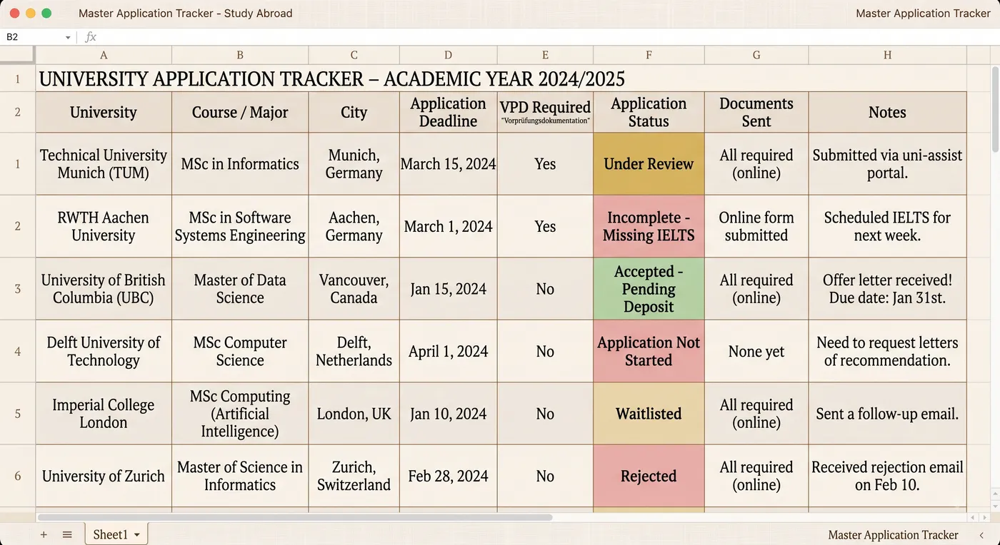

So, congrats! You have decided to study in Germany. But are you still confused about how to find and discover universities and courses? Unlike the US, Germany is not very well explored, and comparatively very few students from India are studying there.

---

## 1. Start With Yourself, Not the Universities

It is important to actually have your interests locked in before you start hunting for colleges in Germany. Do your research on what you would like to pursue for the next two years of your life in the case of a master's degree.

You should also have a rough idea of what your goal is after a master's. Is it to get into research via a PhD, to get a job, or, if you're ambitious, entrepreneurship?

---

## 2. A Quick Word on Cost

Education in Germany is publicly funded, and most master's programmes [1] at German state or public universities [2] charge no tuition fee. [3] You normally pay a semester contribution, often roughly €150 to €350 per semester, depending on the university. [4]

---

## 3. Sorting Out Your Priorities

I believe that a good way to start shortlisting universities is by first of all sorting out your own priorities. These may include things like the following.

### a) Would You Like to Live in a Smaller City or a Bigger City?

Smaller cities usually have a lower cost of living but fewer job opportunities. Bigger cities have better job opportunities but a very high cost of living, and in a few cases a competitive part time job market as well.

It would be preferable if you chose cities with jobs in your field, so that it would be easier to find a Studentenwerk job rather than relying on mini jobs.

### b) Would You Like to Go to a Technische Universität or a Hochschule?

**Technische Universitäten (TUs)** have an academically oriented curriculum, and hence they may feel pretty complex to get started with and have a lot of theory as well. TUs are extremely well acclaimed and have a good reputation, so a master's from a reputed TU is a good pathway to a PhD in future.

**Hochschulen** focus on practical and hands on skills rather than the theoretical aspects of a subject. A Hochschule may not be the best option if you're trying for a PhD, [5] but it can be useful to learn skills if you're trying to land a job in your field of study.

**Technische Hochschulen** are Hochschulen which are technically focused and usually have a strong engineering background attached to them. They usually have good research tracks, although their main focus still remains practical and applied sciences.

Germany has built out separate pathways for research and applied sciences on purpose. Studying at either type of university should not hinder your future job prospects, as employers usually do not show bias based on your university degree unless it's a private university. [6]

### c) Think About Personal Preference

Have a preference based ranking list of universities you have applied to. Rank them based on your city preference, your course preference, and how well each one aligns with your future goals, so that when admits roll in you won't have decision fatigue.

In some cases you may have to weigh out the pros and cons before ranking a college, which in itself gives you good clarity on how things work.

---

## 4. Brief Notes on City Selection

You can obviously choose cities such as Berlin, Munich, Frankfurt and Hamburg, which fall under the category of bigger cities. Meanwhile, the neighbouring cities to these, which are smaller, can be considered if you want a calmer environment with a lower cost of living.

It is important to note that even the smaller cities are connected to the bigger ones via Deutsche Bahn and are only a few hours away if you ever need to travel there.

---

## 5. The Shortlisting Phase

Now that you have your priorities in order, you can start your shortlisting process.

Most of the sources I have referred to point you to DAAD, which contains a list of courses with colleges and adequate filters to find colleges of your liking. But in my personal experience, I have observed that the information is either stale or sometimes even too overwhelming to look at. So I would advise future aspirants to follow this process of shortlisting.

### Step by Step

1. **Figure out the cities** you would like to live in, and filter for your choice of city on the DAAD website.
2. **Filter by your course and your degree type**, whether master's or bachelor's. [7]
3. **Change the course language to English.** Be aware of courses which are mixed German and English. Be sure that the credits required for the degree can be completed entirely in English.
4. **Find all colleges and degree programmes** related to your desired course here.
5. **Go through each degree programme on the official college website** to confirm the details, and read the programme and entry criteria of your desired programme properly to check if you're eligible. [8]

### What to Check on Each Programme Page

Some universities may require GRE, GMAT, TM-WISO or TestAS scores above a particular number to guarantee entry. Some might also require you to have a previous qualification, such as a high school or bachelor's GPA above a cutoff they set, 1.7 for example.

Some programmes also require a language qualification in English at a certain level, such as IELTS 7.0, and even German in some instances. Alongside all of this, keep an eye on the deadline for the submission of applications.

---

## 6. Documents You Need Before You Apply

Some universities may require a preliminary review document, which is a VPD from organisations like uni-assist, in order to apply at all. Make sure you get this before you apply.

All universities will ask for an APS certificate if you're from India, China or Vietnam, so make sure you have it on hand as a prerequisite.

Plan your APS, language exams, GRE, IELTS and GMAT on time so that you can make early applications.

---

## 7. Why Applying Early Matters

Early applications matter in the case of NC-frei programmes. NC-frei means there is no restriction on the number of admissions in a semester, while NC means admission depends on the number of seats available. In both cases, it's important to apply first.

---

## 8. Track Everything

It would be a good idea to create a tracker in Excel after applying.

---

## Footnotes

**[1] Not every kind of master's is free.** The no tuition rule covers consecutive master's programmes, meaning a master's that follows on from a related bachelor's. Non consecutive and continuing education programmes are a different category and usually do charge, even at public universities. Executive MBAs are the obvious example, but a handful of specialised master's programmes fall into this bucket too, and the fees there can run into five figures. Check which category your programme sits in before you assume it's free.

**[2] This applies to public universities only.** Private universities in Germany set their own fees, which commonly run from around €5,000 to €20,000 or more per year. See footnote 6 on why I would think twice about that route anyway.

**[3] Baden-Württemberg is the exception you're most likely to run into.** Since winter semester 2017/18, all public universities in Baden-Württemberg charge non EU and non EEA students €1,500 per semester, on top of the usual semester contribution. This is a state law, not a decision by individual universities, so it applies across the whole state. That includes Stuttgart, Karlsruhe (KIT), Heidelberg, Mannheim, Freiburg and around fifty other institutions. Exemptions exist but the quota is small and the criteria are strict, so do not plan around getting one. If you already hold a German university entrance qualification, or you are an EU or EEA citizen, you don't pay.

**[4] Bavaria is the newer exception, and it's a big one.** The Bavarian Higher Education Innovation Act of 2023 allowed Bavarian universities to charge non EU students. So far TUM is the only one that has actually done it, but the amounts are much higher than Baden-Württemberg. For students newly enrolling from winter semester 2024/25 onward, TUM charges roughly €2,000 to €3,000 per semester for bachelor's programmes and €4,000 to €6,000 per semester for master's programmes, depending on the specific programme. That works out to as much as €12,000 a year. Some TUM master's programmes are still free for non EU students, so check the fee on the individual programme page rather than assuming. Worth noting that LMU, also in Munich, still charges nothing, so two universities in the same city can differ enormously.

**[5] The real limitation of a Hochschule for a PhD.** It isn't about prestige. Hochschulen generally cannot award doctorates on their own, that right sits with universities and TUs. There are cooperative arrangements where a Hochschule professor supervises you and a partner university awards the degree, and some states have been expanding these, but it's an extra hurdle rather than a straight path. If a PhD is your goal, this is the single most practical reason to lean towards a TU.

**[6] On private universities.** My honest advice is to stay away from them. A large share of the private institutions marketing aggressively to Indian students are effectively degree mills. They will take your money, they are far easier to get into than a public university, and that is precisely the problem, because German employers know it. A private university on your CV can work against you here in a way that a Hochschule name never will. Given that public education in Germany is free and genuinely good, paying €15,000 a year for a worse signal makes very little sense to me. Do your own research before you decide, but go in knowing how these places are perceived.

**[7] Most bachelor's programmes are taught in German.** English taught programmes exist in large numbers at master's level, but at bachelor's level they are comparatively rare and are concentrated at a small number of institutions. If you're filtering for a bachelor's in English on DAAD, expect a much shorter list than you were hoping for. Realistically, if you want to do your bachelor's in Germany, plan on learning German to roughly B2 or C1.

**[8] Indian applicants and the bachelor's entry requirement.** For a bachelor's, an Indian Class 12 certificate on its own usually does not qualify you for direct entry into a German university. You will typically need to complete a Studienkolleg, which is a one year foundation course ending in an assessment exam, or have completed a year or more of a recognised degree in India first. For a master's, a three year Indian bachelor's is often accepted but not universally, and some programmes want a four year degree or specific credit coverage in particular subjects. This is exactly the sort of thing that varies from programme to programme, which is why reading the individual entry criteria matters so much. Rules here also change, so verify against the official university page and the Anabin database rather than relying on any blog, including this one.
